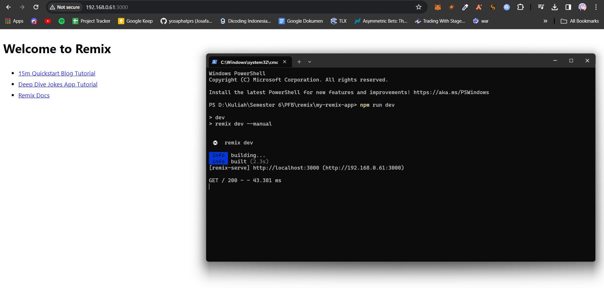
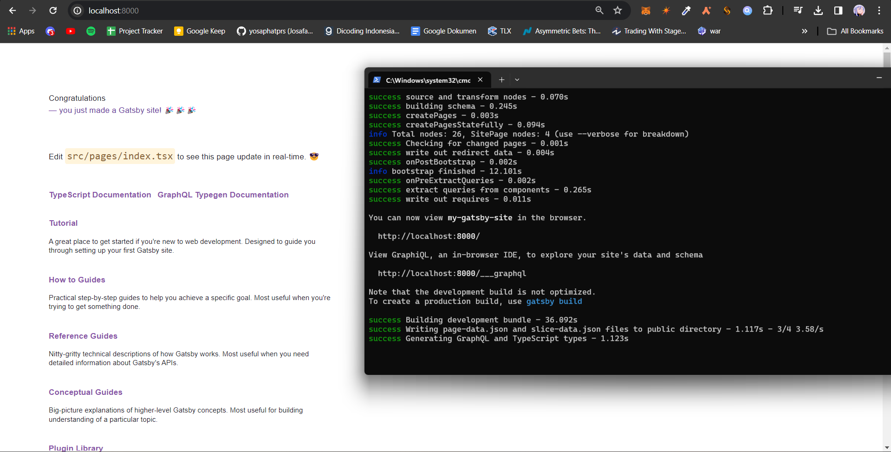
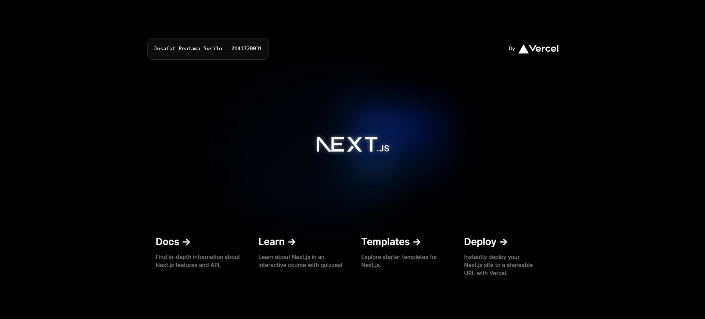
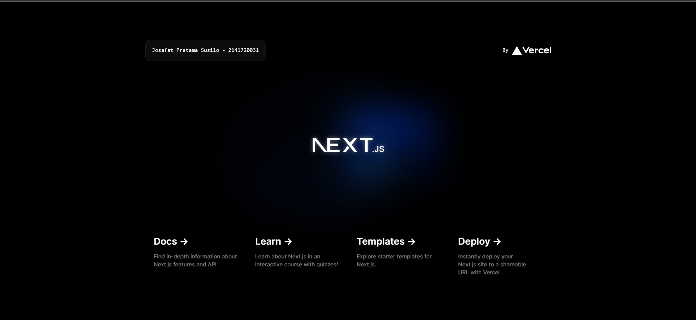
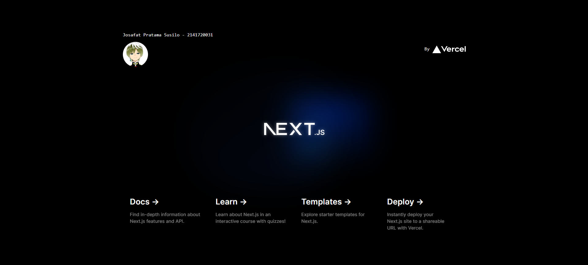

## Laporan Praktikum

|  | Pemrograman Berbasis Framework 2024 |
|--|--|
| NIM |  2141720031 |
| Nama |  Josafat Pratama Susilo |
| Kelas | TI - 3A |

### Jawaban Soal 1

| Istilah | Arti |
| -- | -- |
| TypeScript | TypeScript adalah bahasa pemrograman yang memungkinkan programmer javascript untuk melakukan static typing pada kode programnya (contohnya adalah dapat mendeklarasi tipe data primitif seperti string atau integer pada javascript) |
| ESLint | ESLint adalah sebuah sebuah tool untuk membantu mengidentifikasi dan menganalisis error pada kode program |
| Tailwind CSS | Tailwind CSS adalah framework css seperti bootstrap, namun memiliki kelebihan seperti lebih fleksibel dan lebih mudah untuk dikustomisasi |
| App Router | App Router adalah sebuah tool untuk membantu membuat sistem navigasi di dalam aplikasi next.js lebih mudah. App Router ini memungkinkan programmer menggunakan react server component |
| Import alias | Import alias adalah cara untuk memanggil module dengan nama yang lebih singkat |

### Jawaban Soal 2

| Nama File/Folder | Arti |
| -- | -- |
| .git | .git adalah folder yang digunakan untuk menyimpan semua informasi yang diperlukan oleh git |
| node_modules | node_modules adalah folder yang digunakan untuk menyimpan semua modul yang digunakan oleh proyek |
| public | public adalah folder yang digunakan untuk menyimpan file yang dapat diakses oleh publik |
| src | src adalah folder yang digunakan untuk menyimpan file yang digunakan untuk developing aplikasi atau source code dari aplikasi |
| .eslintrc.json | .eslintrc.json adalah file yang digunakan untuk konfigurasi ESLint |
| .gitignore | .gitignore adalah file yang berisi nama-nama file atau folder yang akan diabaikan dan tidak ingin di-track oleh git |
| next.config.js | next.config.js adalah file yang digunakan untuk konfigurasi Next.js |
| next-env.d.ts | next-env.d.ts adalah file yang bertujuan untuk memastikan penulisan di dalam Next.js dapat dideteksi oleh TypeScript |
| package.json | package.json adalah file berisi pendefinisian aplikasi yang dikembangkan beserta dependencies/library yang digunakan |
| package-lock.json | package-lock.json digunakan untuk pendefinisian dependencies aplikasi namun versinya dikunci pada versi spesifik |
| postcss.config.js | postcss.config.js adalah file yang digunakan untuk konfigurasi PostCSS |
| README.md | README.md adalah file yang biasanya berisi tentang informasi dari aplikasi tersebut |
| tailwind.config.js | tailwind.config.js adalah file yang digunakan untuk konfigurasi Tailwind CSS |
| tsconfig.json | tsconfig.json adalah file yang digunakan untuk konfigurasi TypeScript |

### Jawaban Soal 3

Hasil perubahan:

Perubahan itu dapat tampil tanpa harus melakukan refresh halaman dikarenakan Next.js lebih spesifiknya react memiliki fitur hot reload.

### Jawaban Tugas Praktikum

Remix:

Perbedaan Remix adalah

Tidak seperti Gatsby dan Next.js, remix menggunakan nested route untuk routingnya. Remix juga mendukung automatic code splitting dan sama seperti next.js, remix juga mendukung server side rendering.

Gatsby:

Perbedaan Gatsby adalah

Gatsby ditujukan untuk mengembangkan website secara cepat dan teroptimasi. Hal ini dikarenakan Gatsby menggunakan GraphQL untuk melakukan query data dari berbagai sumber dan menawarkan ekosistem plugin yang luas sehingga mudah untuk menambahkan fitur baru dan integrasinya. Perbedaan Gatsby terletak pada server side rendering yang tidak didukung jika menggunakan Gatsby.

### Jawaban Soal 4

Tidak ada perubahan tampilan, karena ketika memanggil komponen, akan diperlakukan seperti kode di dalam komponen tersebut.

### Jawaban Soal 5

Sama seperti nomor 4, tidak ada perubahan tampilan, karena ketika memanggil komponen MyPage yang berisi seluruh kode fungsi Home, maka akan diperlakukan seperti kode di dalam komponen tersebut.

### Jawaban Soal 6

